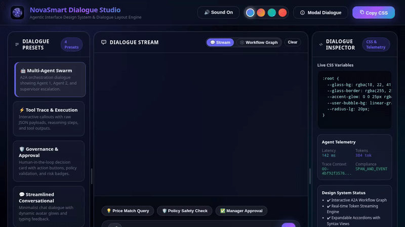

# NovaSmart AI Governance Studio

<p align="center">
  
  
  
  
  
  
  
</p>



## 📌 Project Overview

**NovaSmart AI Governance Studio** is a state-of-the-art agentic AI control plane and interactive dialogue studio built on Google Cloud Platform and Vertex AI. It provides enterprise teams with real-time AI compliance monitoring, policy enforcement, multi-agent orchestration visualization, and multimodal media generation powered by Google's **Gemini Omni** model (`gemini-omni-flash-preview`).

---

## 🎯 What Problem Does This Project Solve?

Modern AI agents and multi-agent swarms operate with high autonomy, creating critical enterprise governance challenges:

1. **Black-Box Agent Orchestration**: Traditional LLM chats obscure how agents delegate tasks, execute tool calls, and route requests across multi-agent pipelines.
2. **Uncontrolled Risk & Policy Violations**: Autonomous agents can issue unauthorized discounts, override safety thresholds, or bypass pricing guidelines without human confirmation.
3. **Auditability & Traceability Deficits**: Lack of real-time telemetry, structured JSON tool call traces, and persistent cloud audit logs makes regulatory compliance impossible.

---

## 💡 Key Benefits of NovaSmart AI Governance Studio

- **Full Multi-Agent Transparency**: Visualizes agent-to-agent (A2A) workflows on an interactive 6-node SVG graph showing request routing, tool calls, and supervisor escalations.
- **Human-in-the-Loop Policy Guardrails**: Automatically triggers interactive policy approval modals whenever financial or policy risk thresholds (e.g., >15% price override) are breached.
- **Seamless Multimodal Generation**: Integrates Google's Gemini Omni model to generate domain product videos, auto-persist binary artifacts to the ADK Playground panel, and upload public HTTPS video streams directly to Google Cloud Storage.
- **Zero-Latency Telemetry**: Displays live latency (ms), token usage, trace contexts, and confidence ring gauges for every dialogue turn.

---

## ⚡ Prerequisites

Before setting up or deploying NovaSmart AI Governance Studio, ensure you have:

1. **Google Cloud Platform Account & Project**:
   - GCP Project ID with active billing enabled.
   - Vertex AI API (`aiplatform.googleapis.com`) enabled.
   - Google Cloud Storage API enabled.
2. **GCP Cloud Storage Bucket**:
   - Public or configured GCS bucket (e.g. `novasmart-seed-bucket-qwiklabs-gcp-03-1405d3f8adce`).
3. **Local Development Tools**:
   - **Python**: Version `3.10` or higher.
   - **Node.js**: Version `18.0` or higher.
   - **Google Cloud SDK (`gcloud`)**: Installed and authenticated (`gcloud auth application-default login`).

---

## ⚙️ Post-Settings & Environment Configuration

After cloning the repository, perform the following post-settings to configure public video uploads and permissions:

### 1. Bucket IAM Public Read Configuration
Grant public object viewer access to your GCS bucket so generated media streams are publicly accessible over HTTPS:
```bash
gcloud storage buckets add-iam-policy-binding gs://<YOUR_BUCKET_NAME> \
  --member=allUsers \
  --role=roles/storage.objectViewer
```

### 2. Vertex AI Global Region Setting
Set your Google Cloud project and region variables in your environment:
```bash
export GOOGLE_CLOUD_PROJECT="<YOUR_GCP_PROJECT_ID>"
export GOOGLE_CLOUD_REGION="global"
```

### 3. Application Authentication
Initialize Application Default Credentials (ADC):
```bash
gcloud auth application-default login
```

---

## 💻 Local Setup & Run Instructions

### 1. Install Node.js Dependencies
```bash
npm install
```

### 2. Start Local Server Daemon
```bash
python3 -m http.server 8080 --bind 0.0.0.0
```

Once running, access the studio in your browser at `http://localhost:8080`.

### 3. Run Automated Playwright Verification Suite
```bash
node run_playwright_test.js
```

---

## 📁 Project Directory & File Structure

```text
novasmart-ai-governance-studio/
├── README.md                     # Comprehensive project documentation & guide
├── LICENSE                       # MIT open source license
├── demo.gif                      # Optimized looping demo video recording
├── index.html                    # Main glassmorphic dialogue UI application
├── index.css                     # Glassmorphism design tokens, theme palettes & animations
├── app.js                        # Token streaming engine, audio synthesizer & workflow graph
├── avatar.png                    # Brand avatar asset for NovaSmart AI agent
├── generate_item_video_tool.py   # ADK tool for Gemini Omni video generation & GCS upload
├── start_server_daemon.py        # Python HTTP server daemon script
├── record_agent_demo.js          # Playwright script for automated video demo recording
├── run_playwright_test.js        # End-to-end automated UI verification test suite
├── package.json                  # Node.js project manifest & dependencies
├── package-lock.json             # Locked dependency versions (Playwright, ffmpeg-static)
├── .gitignore                    # Git ignore file excluding build and temporary assets
├── tools/                        # ADK Python tools directory
│   └── generate_item_video_tool.py
├── scripts/                      # Utility and automation scripts
│   ├── start_server_daemon.py
│   ├── record_agent_demo.js
│   └── run_playwright_test.js
└── assets/                       # Media and visual assets
    ├── avatar.png
    └── demo.gif
```

---

## 🛠️ Google Cloud Services & Tools Status

| Service / Tool | Status | Details |
|---|---|---|
| **Google Cloud Storage (GCS)** | `Implemented` | Direct in-memory byte upload to public bucket `novasmart-seed-bucket-qwiklabs-gcp-03-1405d3f8adce`. |
| **Vertex AI / Gemini Omni Model** | `Implemented` | `gemini-omni-flash-preview` model in `global` region via `client.interactions.create`. |
| **ADK Artifact Service** | `Implemented` | Binary artifact persistence using `tool_context.save_artifact`. |
| **Google Agents CLI & ADK** | `Implemented` | Agent Development Kit tool function definitions. |
| **Firestore Audit Logging** | `Planned, not yet implemented` | Firestore project reference hardcoded; live Firestore SDK integration planned for v2.0. |
| **Memory Bank (Long-term Knowledge)** | `Planned, not yet implemented` | Cross-session memory bank integration planned for future release. |
